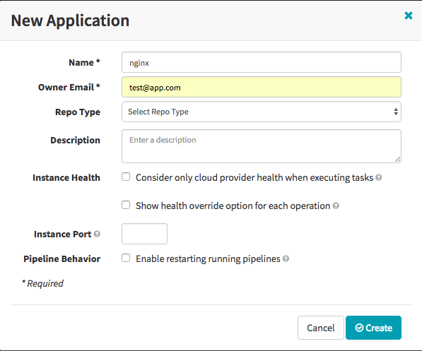
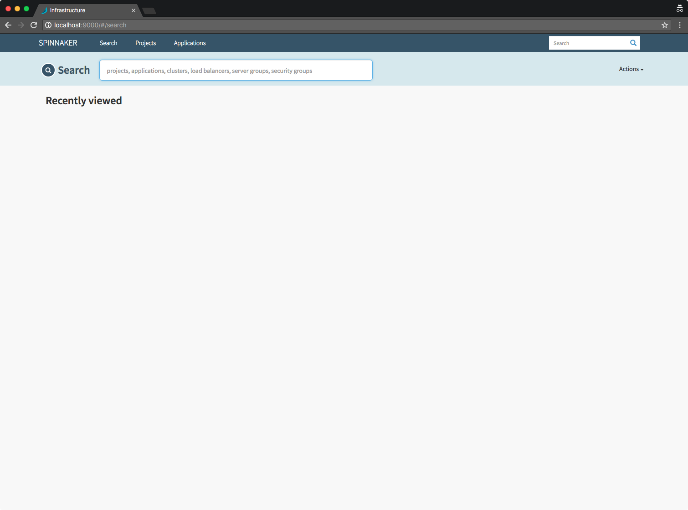
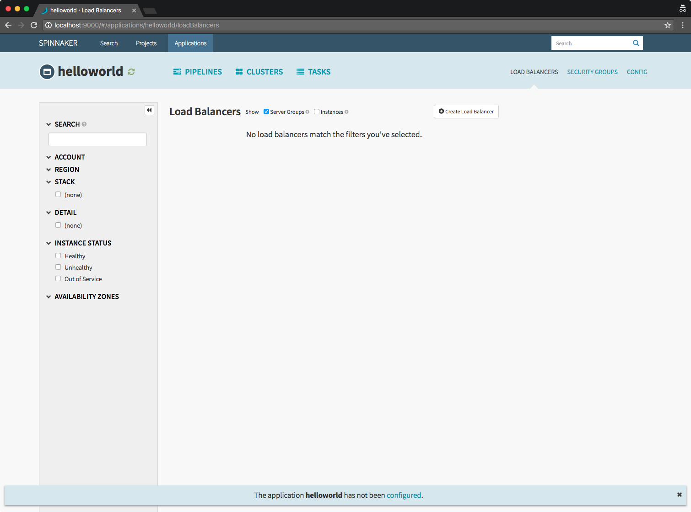
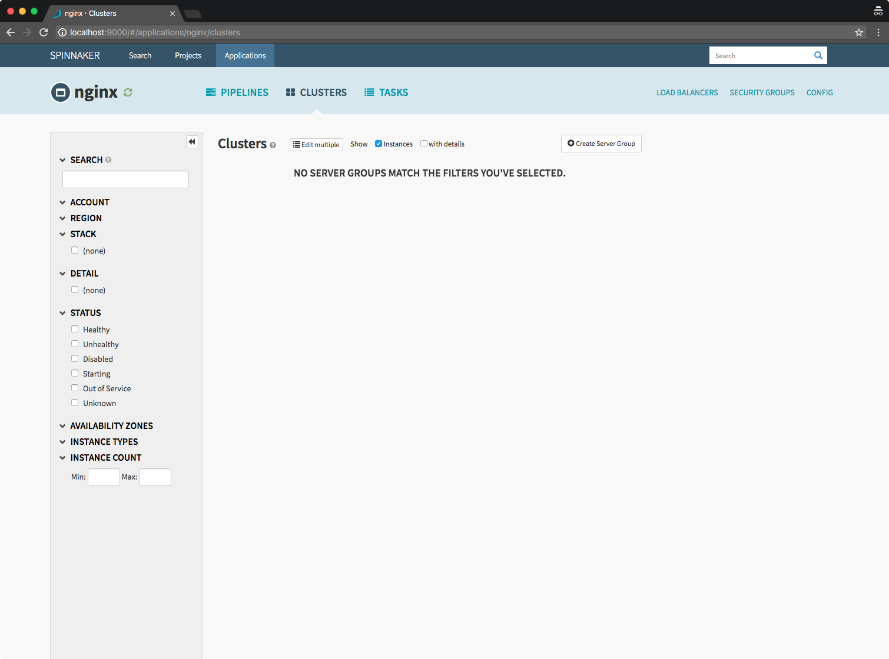
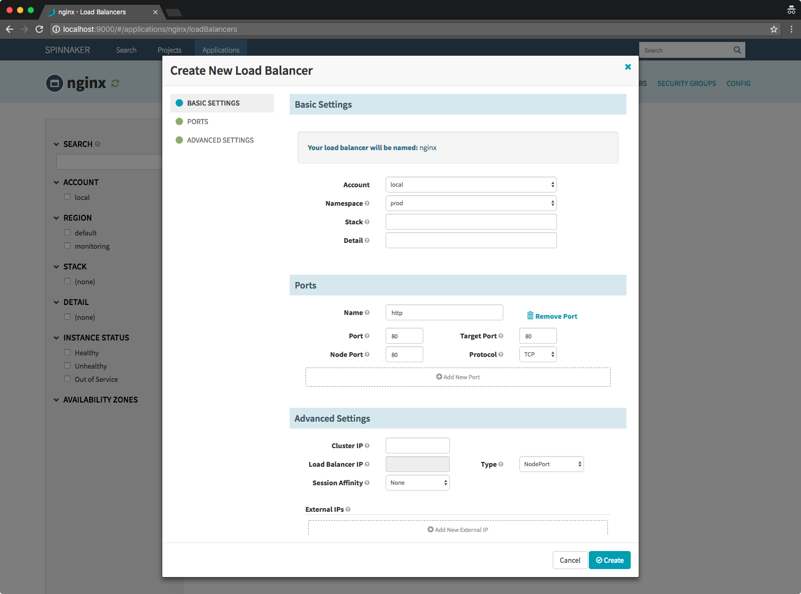
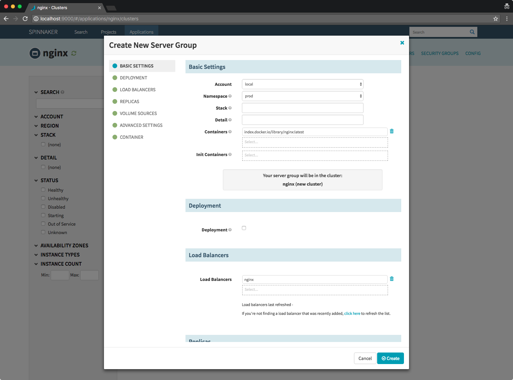
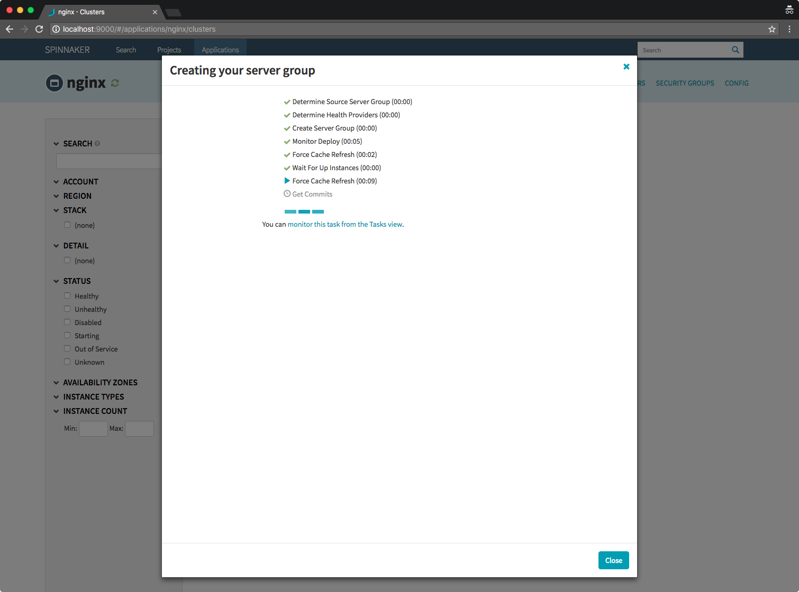

<!-- START doctoc generated TOC please keep comment here to allow auto update -->
<!-- DON'T EDIT THIS SECTION, INSTEAD RE-RUN doctoc TO UPDATE -->
**Table of Contents**  *generated with [DocToc](https://github.com/thlorenz/doctoc)*

- [Spinnaker Walk Through](#spinnaker-walk-through)
  - [Important Installation Considerations](#important-installation-considerations)
  - [Installation](#installation)
  - [Post installation step](#post-installation-step)
    - [Enable permission to the service account](#enable-permission-to-the-service-account)
    - [Create namespace for your deployment](#create-namespace-for-your-deployment)
  - [Deploying and Scaling a Containerized Application through Spinnaker](#deploying-and-scaling-a-containerized-application-through-spinnaker)

<!-- END doctoc generated TOC please keep comment here to allow auto update -->

# Spinnaker Walk Through

## Important Installation Considerations

Spinnaker will allow you to orchestrate the continuous deployment of applications into your cluster, for this, Spinnaker need to have access to the docker registries of this applications.

You need to specify the credentials and the path to which docker repositories you want to enable before installing in the [values.yaml](values.yaml#L15-L19)

As you can see, by default the only enabled libraries are the following:

```yaml
accounts:
- name: dockerhub
  address: https://index.docker.io
  repositories:
    - library/alpine
    - library/ubuntu
    - library/centos
    - library/nginx
```

## Installation

For installing spinnaker just follow [this](README.md) instructions.

## Post installation step

### Enable permission to the service account

Once installed, Spinnaker will require for us to grant it access to the cluster, for this we will create a ClusterRoleBinding:

```bash
$ kubectl apply -f ClusterRoleBinding.yaml
clusterrolebinding "spinnaker" created
```

Note that this will give Spinnaker admin access to the cluster, you might want to limit the permissions in a production deployment.

### Create namespace for your deployment

Spinnaker cannot create namespaces, because of this we will first create a namespace for our deployments:

```bash
$ kubectl create namespace prod
namespace "prod" created
```

## Deploying and Scaling a Containerized Application through Spinnaker

Assuming that you have cli access to the cluster, you can access Spinnaker deck with:

```bash
export DECK_POD=$(kubectl get pods --namespace spinnaker -l "component=deck,app=spinnaker-spinnaker-spin" -o jsonpath="{.items[0].metadata.name}")
kubectl port-forward --namespace spinnaker $DECK_POD 9000 &
open http://localhost:9000
```

Once opened you will see the following screen:



Let’s get familiar with Spinnaker concepts and terminology by deploying a simple Nginx web server.

Start by creating an application by clicking on Create Application under the Actions menu on the right top corner.

An “application” here is a logical collection of various resources such as Load Balancers, Security Groups, Server Groups, and Clusters.



Let’s create a Load Balancer through which the application can be accessed. The Spinnaker Load Balancer would be similar to a Service in Kubernetes.

Click on the Load Balancer on the top menu bar, and then click on the Create Load Balancer button.



When creating a new Load Balancer, select prod as the namespace, 80 for Target Port, and choose NodePort as Type. Click on Create button when done.



Now lets create a deployment of nginx for our service or load balancer, under Clusters, click on Create Server Group.
                                                                       


When creating a new Server Group, select prod as the namespace. Choose nginx:latest as the container from the dropdown. Choose nginx as the Load Balancer, which we created in the previous step. Type 10 as capacity.



Wait for the instances under the Server Group to become available. The red colored blocks indicate that the instances are not ready yet.




Switch to the terminal, and run the following command:

```bash
$ kubectl get pods -n prod
NAME               READY     STATUS    RESTARTS   AGE
nginx-v000-2kb7w   1/1       Running   0          1m
nginx-v000-4xsdw   1/1       Running   0          1m
nginx-v000-9jtnt   1/1       Running   0          1m
nginx-v000-d77wp   1/1       Running   0          1m
nginx-v000-fzfnx   1/1       Running   0          1m
nginx-v000-j4q4m   1/1       Running   0          5m
nginx-v000-kbvcm   1/1       Running   0          1m
nginx-v000-kj2zp   1/1       Running   0          1m
nginx-v000-nnrmb   1/1       Running   0          1m
nginx-v000-v2pwg   1/1       Running   0          1m
$ kubectl get services -n prod
NAME      TYPE       CLUSTER-IP     EXTERNAL-IP   PORT(S)        AGE
nginx     NodePort   10.96.28.126   <none>        80:30887/TCP   4m
```

